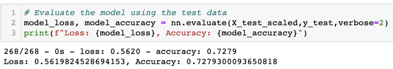

# Neural_Network_Charity_Analysis

## Overview

The purpose of this analysis is to build a binary classification model capable of predicting whether a charity will effectively use the money raised if funded. By leveraging machine learning and neural networks, a deep learning model is generated to analyze metadata of charities previously funded and evaluate the potential success of charities seeking new funding based on those same criteria. After generating the initial neural network model and measuring its efficacy, various adjustments to its inputs and structure are implemented in order to optimize performance.

## Results

### Data Preprocessing

- The IS_SUCCESSFUL variable is the target of the model
- The following variables are the features of the model:
  - APPLICATION_TYPE
  - AFFILIATION
  - CLASSIFICATION
  - USE_CASE
  - ORGANIZATION
  - STATUS
  - INCOME_AMT
  - SPECIAL_CONSIDERATIONS
  - ASK_AMT
- The following identification variables are neither targets nor features and are dropped from the input data:
  - EIN
  - NAME

### Compiling, Training, and Evaluating the Model

- The initial model is structured as follows:
  - Layers:
    - First hidden layer: 80 neurons with ReLU as the activation function
    - Second hidden layer: 30 neurons with ReLU as the activation function
    - Output layer: 1 neurons with Sigmoid as the activation function
  - 110 neurons were used in the hidden layer, as it's roughly 2.5x the number of input features (43)
  - The ReLU activation function was selected for both hidden layers as all feature values are positive
  - The Sigmoid activation was selected for the output as the model is a binary classifier
  - Model summary:
  
  

- The original model had an accuracy of .7298, falling short of the .75 target performance
  - 

- 3 attempts were made to optimize performance and achieve an accuracy > .75
  - The different approaches taken to improve performance are outlined below:
    - Attempt 1: dropping the potentially noisy variables, STATUS and SPECIAL_CONSIDERATIONS, from features
    - Attempt 2: using the preprocessed and scaled data from the original attempt, auto-optimize the model by leveraging keras-tuner to get the best hyperparameters for the model
    - Attempt 3: adjusting the original input data by using different bin values and binning an additional variable
      - The APPLICATION_TYPE count threshold was raised to 1,000 from 500
      - The CLASSIFICATION count threshold was lowered to 500 from 1,500
      - The INCOME_AMT variable was binned using a count value threshold of 3,000

## Summary

Each of the 3 attempts to optimize the model's performance did not result in a meaningful change to accuracy, and all 3 versions failed to achieve the target performance accuracy of .75. The results summary of each attempt are listed below:

- Attempt 1: dropping potentially noisy variables caused performance to fall slightly, resulting in an accuracy of .7279
  - 

- Attempt 2: auto-optimizing the hyperparameters led to the best performance with an accuracy of .7326
  - 

- Attempt 3: adjusting and adding bins resulted in the worst performance with an accuracy .7275
  - 

Given the inability to achieve the target performance using the methods summarized above on the existing set of organizational metadata, I would recommend examining the dataset before further attempts to optimize the model are made. A deeper understanding of the meaning and impact of each variable currently contained in the metadata might allow for better decisions regarding variable inclusion and binning during the data preprocessing phase. Additionally, more financial data -wether in continuous or categorical form- might strengthen the ability to predict if future funding will be used effectively.
